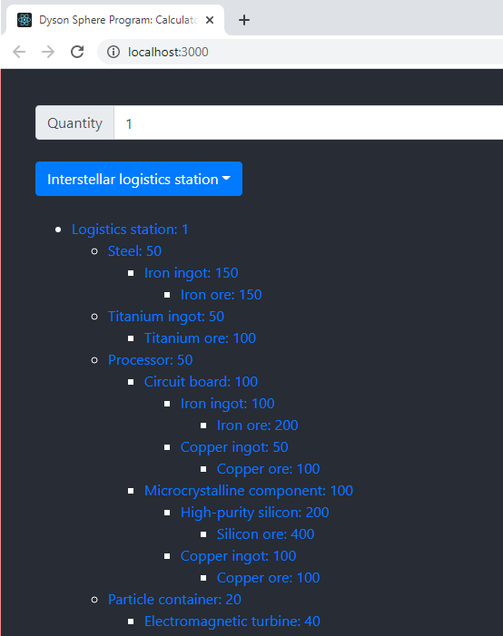

This is just a simple React calculator for [Dyson Sphere Program](https://store.steampowered.com/app/1366540/Dyson_Sphere_Program/), a game that I highly recommend. (Particularly if you're a fan of Satisfactory, Factorio, etc.)

This is just a simple React app that will show you all of the subcomponents needed to make a specified quantity of a specific item, like:

# How do I run this?

Unfortunately there's currently no easy way to run this other than setting up a basic React dev environment. If you want to do that:

1. Install [git](https://git-scm.com/downloads)
1. Install [Node LTS](https://nodejs.org/en/download/)
1. Open a console window
1. Type `npm i -g yarn` to install yarn (package manager utility for app)
1. Enter a directory you wish to store source code in and type `git clone https://github.com/JasonGore/dsp-calculator.git`
1. Type `cd dsp-calculator` to enter cloned directory
1. Type `yarn` to install necessary modules
1. Type `yarn start` to launch the app (it should open a browser window, but is otherwise available at http://localhost:3000/)

# How can I browse the code?

I'd just install [VS Code](https://code.visualstudio.com/), launch it, and then "Open Folder" and select the `dsp-calculator` directory. (Or better yet, just run `code .` from the `dsp-calculator` directory.)

# Can I help?

Certainly! There's tons of recipes and data missing and the core data is [here](https://github.com/JasonGore/dsp-calculator/blob/master/src/data/recipes.tsx).

# What other things could be implemented?

Tons of things. Ideas I have:
* Add tons of missing recipes
* Alternate recipes
* Whether items can be made in replicator or not
* Facility that manufactures item
* Improved styling and presentation
* Make app deployable and more easily consumable
